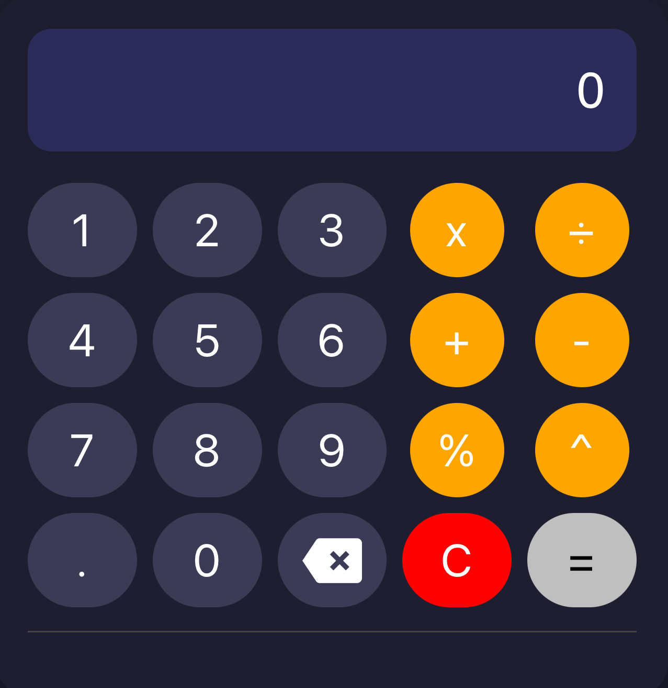

# Calculator App  

A simple web-based calculator built with **HTML**, **CSS**, and **JavaScript**.  

## Features
- Perform basic arithmetic: addition, subtraction, multiplication, division
- Percentage (%) calculatio
- Exponentiation (^) support
- Clear function (C) to reset input  
- Responsive design (works on mobile and desktop)  
- Hover effects for buttons  
- Keyboard input support  
- History of previous calculations  

## Screenshot

## Live Demo
[View on GitHub Pages](https://sharonugah.github.io/calculator-app/)

## Technologies Used
- HTML  
- CSS  
- JavaScript
